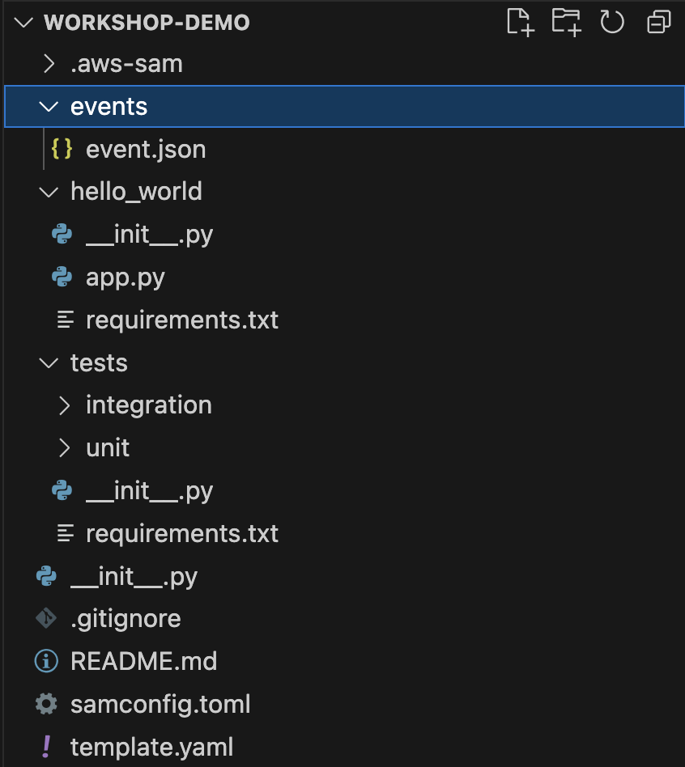
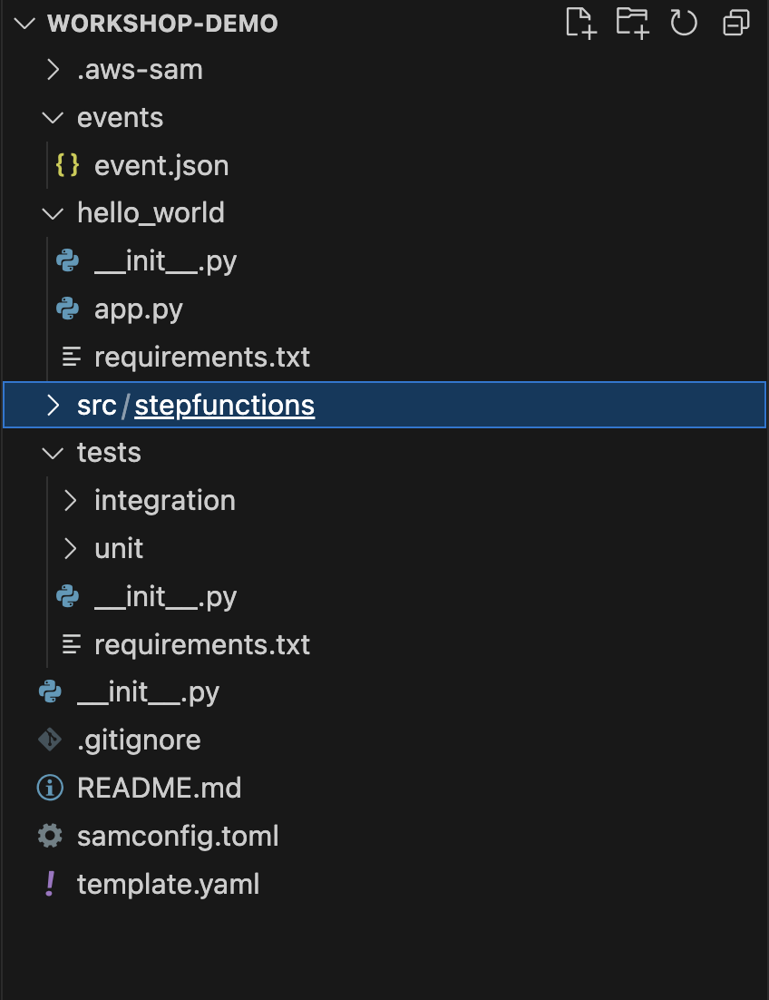
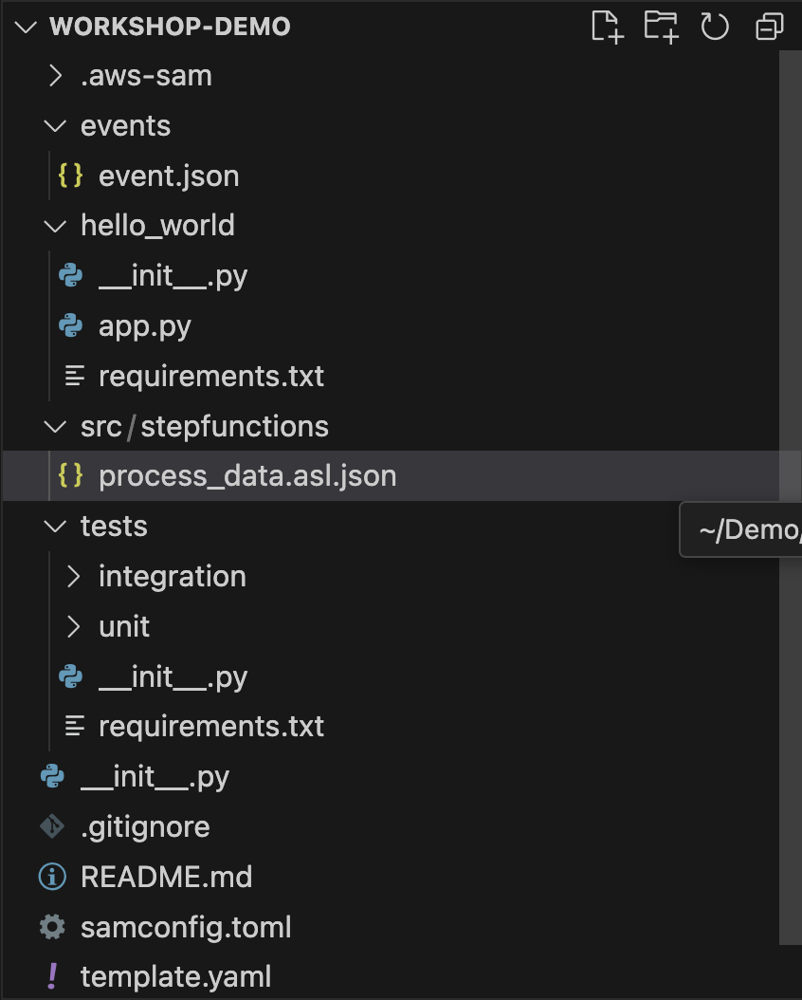

# Adding A Step Function to our Project

In order to add a **Step Function** to our project we need to do two things:
1. Add a **Definition File** to the project that will contain all of the configuration details of the **Step Function**.
2. Add the **Step Function** to our template.yaml file which is basically just a **cloudformation** template and will be responsible for deploying what's defined in the **Definition File**.

## Adding A Definition File
To start off with we'll add a very simple, bare bones definition that just deploys a **Step Function** that does nothing. 

But before we start, we should take a look at the folder structure of the current project.



As you can see if the above screenshot, we have a number of files and folders already residing in our project. We will be changing the layout of this as we progress, otherwise you can find that things get a little messy and confussing.

For the time being, we need to create a new folder to host our **definition file**.
1. Start by creating a **src** folder in the root of the project and a **StepFunctions** folder under that so that you end up with something looking like this:



2. Next we can create the **Definition File** which is a modified JSON file. Create a new file called **process_data.asl.json** in our newly created folder.



3. Now it's time for code. As mentioned earlier, We'll start by adding a very simple definition that doesn't do anything more than passing a success message. Copy the below text into the json file and save it.
```
{
  "QueryLanguage": "JSONata",
  "Comment": "A description of my state machine",
  "StartAt": "Success",
  "States": {
    "Success": {
      "Type": "Succeed"
    }
  }
}
```

And that's it, we now have a defined Step Function. Next, it's time for us to add it to our cloudformation template.

## Adding our Step Function to CloudFormation
Because we are leveraging AWS SAM, we can define our Step Function in CloudFormation using the **AWS::Serverless::StateMachine** resource type.

1. To start, Open the **template.yaml** file that's located in the root of our project.

```
AWSTemplateFormatVersion: '2010-09-09'
Transform: AWS::Serverless-2016-10-31
Description: >
  Workshop-Demo

  Sample SAM Template for Workshop-Demo

# More info about Globals: https://github.com/awslabs/serverless-application-model/blob/master/docs/globals.rst
Globals:
  Function:
    Timeout: 3

Resources:
  HelloWorldFunction:
    Type: AWS::Serverless::Function # More info about Function Resource: https://github.com/awslabs/serverless-application-model/blob/master/versions/2016-10-31.md#awsserverlessfunction
    Properties:
      CodeUri: hello_world/
      Handler: app.lambda_handler
      Runtime: python3.13
      Architectures:
        - x86_64
      Events:
        HelloWorld:
          Type: Api # More info about API Event Source: https://github.com/awslabs/serverless-application-model/blob/master/versions/2016-10-31.md#api
          Properties:
            Path: /hello
            Method: get

Outputs:
  # ServerlessRestApi is an implicit API created out of Events key under Serverless::Function
  # Find out more about other implicit resources you can reference within SAM
  # https://github.com/awslabs/serverless-application-model/blob/master/docs/internals/generated_resources.rst#api
  HelloWorldApi:
    Description: "API Gateway endpoint URL for Prod stage for Hello World function"
    Value: !Sub "https://${ServerlessRestApi}.execute-api.${AWS::Region}.amazonaws.com/Prod/hello/"
  HelloWorldFunction:
    Description: "Hello World Lambda Function ARN"
    Value: !GetAtt HelloWorldFunction.Arn
  HelloWorldFunctionIamRole:
    Description: "Implicit IAM Role created for Hello World function"
    Value: !GetAtt HelloWorldFunctionRole.Arn
```

2. Under the **Resources** section, we are going to add a new resource. To do this, add the following code under the **HelloWorld** resource.
```
  StateMachine:
    Type: AWS::Serverless::StateMachine
    Properties:
      DefinitionUri: src/stepfunctions/process_data.asl.json
```

3. So, you should end up with something that looks like:
```
AWSTemplateFormatVersion: '2010-09-09'
Transform: AWS::Serverless-2016-10-31
Description: >
  Workshop-Demo

  Sample SAM Template for Workshop-Demo

# More info about Globals: https://github.com/awslabs/serverless-application-model/blob/master/docs/globals.rst
Globals:
  Function:
    Timeout: 3

Resources:
  HelloWorldFunction:
    Type: AWS::Serverless::Function # More info about Function Resource: https://github.com/awslabs/serverless-application-model/blob/master/versions/2016-10-31.md#awsserverlessfunction
    Properties:
      CodeUri: hello_world/
      Handler: app.lambda_handler
      Runtime: python3.13
      Architectures:
        - x86_64
      Events:
        HelloWorld:
          Type: Api # More info about API Event Source: https://github.com/awslabs/serverless-application-model/blob/master/versions/2016-10-31.md#api
          Properties:
            Path: /hello
            Method: get
  StateMachine:
    Type: AWS::Serverless::StateMachine
    Properties:
      DefinitionUri: src/stepfunctions/process_data.asl.json

Outputs:
  # ServerlessRestApi is an implicit API created out of Events key under Serverless::Function
  # Find out more about other implicit resources you can reference within SAM
  # https://github.com/awslabs/serverless-application-model/blob/master/docs/internals/generated_resources.rst#api
  HelloWorldApi:
    Description: "API Gateway endpoint URL for Prod stage for Hello World function"
    Value: !Sub "https://${ServerlessRestApi}.execute-api.${AWS::Region}.amazonaws.com/Prod/hello/"
  HelloWorldFunction:
    Description: "Hello World Lambda Function ARN"
    Value: !GetAtt HelloWorldFunction.Arn
  HelloWorldFunctionIamRole:
    Description: "Implicit IAM Role created for Hello World function"
    Value: !GetAtt HelloWorldFunctionRole.Arn
```
