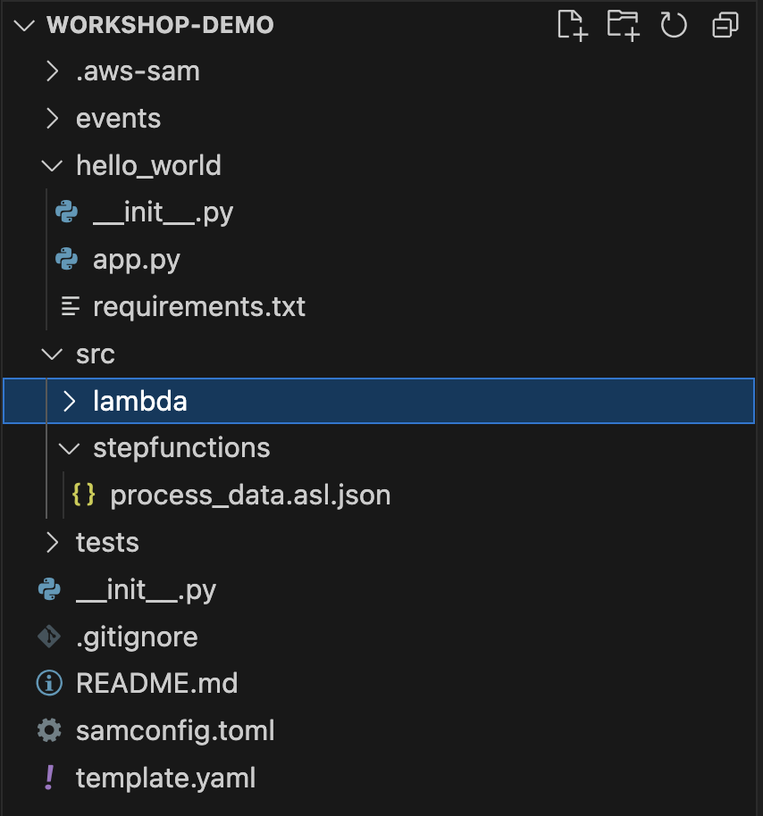
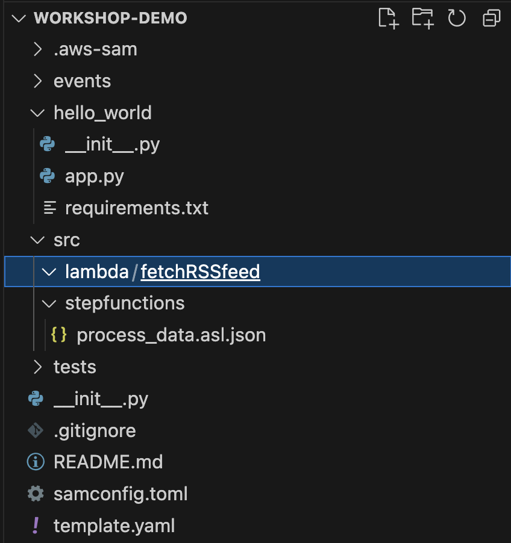

# Adding a Lambda Function
With our Step Function now in place, it's time to add the Lambda function that will fetch the records from the RSS feed for us.

Much like the Step function, we have multiple things we need to do in order to deploy a new function:
1. Write the Lambda function and define it's dependancies.
2. Add it's definition to the CloudFormation Template

## Creating the Lambda Function
Firstly, let's add a new Lambda Function code to the project. To do this, all we need to do is create a new folder which we'll do under the **src** folder we created in the previous section.

1. Create a new folder **lambda** under the **src** folder.



2. Under that folder, we can create a **fetchRSSfeed** folder



3. In the **fetchRSSfeed** folder we want to create two files:
- app.py (which will hold the source code of the lambda function)
- requirements.txt (which is where we will define the dependencies of our function)

4. the **app.py** should contain the following code:
```
import requests
import feedparser
import json

def lambda_handler(event, context):
    """
    AWS Lambda handler function to fetch and parse an RSS feed.

    :param event: AWS Lambda event object containing 'feed_url'.
    :param context: AWS Lambda context object (unused).
    :return: JSON response with the list of feed items or an error message.
    """
    feed_url = event.get("feed_url")
    if not feed_url:
        return {"error": "Missing 'feed_url' in event object."}
    
    try:
        response = requests.get(feed_url, timeout=10)
        response.raise_for_status()
    except requests.RequestException as e:
        return {"error": str(e)}
    
    feed = feedparser.parse(response.text)
    
    if feed.bozo:
        return {"error": "Invalid RSS feed format."}
    
    items = []
    for entry in feed.entries:
        items.append({
            "title": entry.get("title", "No title"),
            "categories": entry.get("category", "No Categories"),
            "link": entry.get("link", "No link"),
            "published": entry.get("published", "No date"),
            "summary": entry.get("description", "No summary"),
        })
    
    return {"items": items}
```
5. And the **requirements.txt** should contain a list of required python libraries which in this case is **feedparser** and **requests**
```
requests
feedparser
```

and that's it, you now have the Lambda function written. Next we need to add it to our CloudFormation Template

## Adding a Lambda Function to CloudFormation
With our Lambda Function written, next we need to add a definition to the cloudformation template. 

1. In our **template.yaml** file we need to add the below block to the **resources** section much like we did for the Step Function in the previous chapter.
```
  FetchRSSFeedFunction:
    Type: AWS::Serverless::Function
    Properties:
      CodeUri: src/lambda/fetchRSSfeed/
      Handler: app.lambda_handler
      Runtime: python3.13
      Architectures:
        - x86_64
```

While your at it, you could also remove the **HelloWorld** function from the resources list as well... Which will also require you to remove the **outputs** section as you will no longer have any outputs.

Resulting in a **template.yaml** that should look like:
```
AWSTemplateFormatVersion: '2010-09-09'
Transform: AWS::Serverless-2016-10-31
Description: >
  Workshop-Demo

  Sample SAM Template for Workshop-Demo

# More info about Globals: https://github.com/awslabs/serverless-application-model/blob/master/docs/globals.rst
Globals:
  Function:
    Timeout: 30

Resources:
  FetchRSSFeedFunction:
    Type: AWS::Serverless::Function
    Properties:
      CodeUri: src/lambda/fetchRSSfeed/
      Handler: app.lambda_handler
      Runtime: python3.13
      Architectures:
        - x86_64

  StateMachine:
    Type: AWS::Serverless::StateMachine
    Properties:
      DefinitionUri: src/stepfunctions/process_data.asl.json
```

2. With the **template.yaml** updated, you can now perform a build and a deploy to push the changes to your AWS environment.
```
sam build && sam deploy
```