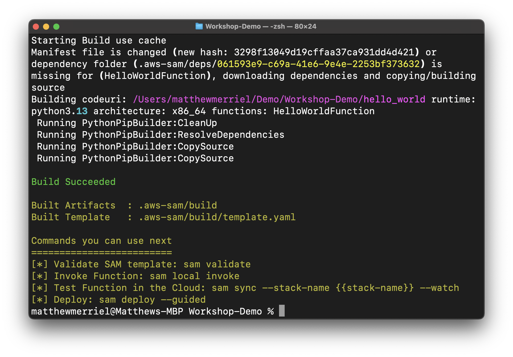
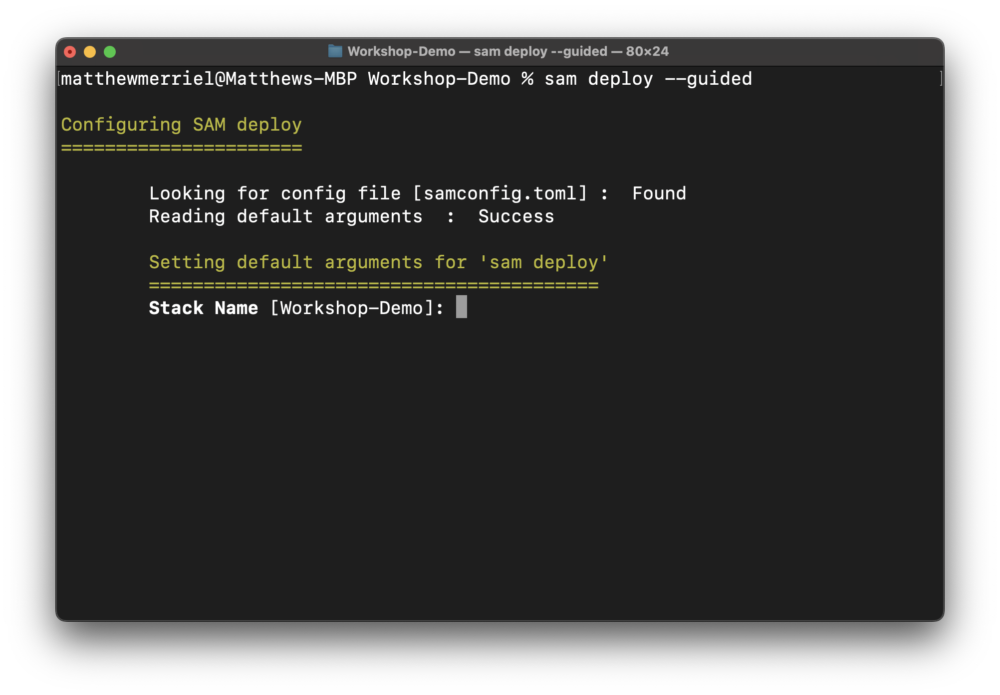
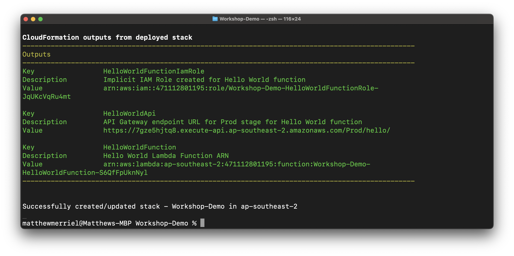
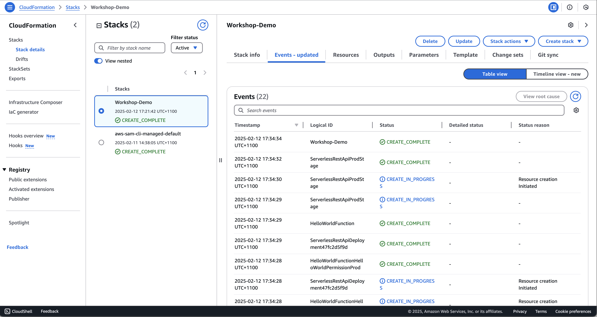

So, we have our project... time to deploy something into AWS.

This sections pretty short, but serves as a checkpoint where we can validate that everything we've done up to this point is working as expected.

# Publish our application
In order to publish a SAM application there are two steps we need to take:
1. Build the application on our local machine
2. Deploy it in AWS

## Builod our Application
Firstly, we need to build our application. At a high level all we're really doing is packaging up each of the components into zip files so that they can easily be deployed into AWS. In the event we have a lambda function that has external dependancies (which we will when we get to the next chapter) the build process will also take care of downloading these and including them in the zip files.

To perform a *Build*, all we need to do is run the following command:
```
sam build
```
this should start the build process and after a while you should get a screen that looks something like the below:



> If you get any error messages, please raise your hand and somebody will come and assit you. It may be that your machine is missing some of the build depenencies or can't find them in your **$PATH** variable. These issues can be numerous so a little 1:1 help is sometimes required.

## Deploy the Application
Once your application is built, the next step is to deploy it.

Under normal cercumstances, this is a simple command. However, in this instance we'll perform a slightly different deploy action so as to be able to provide a few extra paramters. Future deploys will not require these additional interactions. 

1. To get started, run the following command from the root of the project folder:
```
sam deploy --guided
```



2. We give our project the name "Workshop-Demo". This is the name that will appear in the CloudFormation stack that's deployed. Enter the name and press *enter* to continue.

```
	AWS Region [ap-southeast-2]:   
```
3. Type *ap-southeast-2* and press *enter*. You can just press *enter* if your default is already set to *ap-southeast-2* like shown in the above.

```
#Shows you resources changes to be deployed and require a 'Y' to initiate deploy
	Confirm changes before deploy [Y/n]: 
```
4. We will set this to No by pressing *N* and *enter*.

```
#SAM needs permission to be able to create roles to connect to the resources in your template
	Allow SAM CLI IAM role creation [Y/n]: 
```
5. Press *y* and *enter* as we want SAM to be able to deploy our roles for us.

```
#Preserves the state of previously provisioned resources when an operation fails
	Disable rollback [y/N]: 
```

6. Here, we type *N* and *enter*.

```
HelloWorldFunction has no authentication. Is this okay? [y/N]: 
```
7. Next, SAM is simply saying that our Hello World Application has a publically exposed Lambda function with No authentication. For the moment we are OK with this as it's going to get removed in the next chapter, so we can go ahead and type *Y* and *enter* to continue.

```
Save arguments to configuration file [Y/n]: 
```
8. Finally, it's asking if we'd like to save our arguments to a configuration file. Go ahead and type *Y* and *enter*.

```
SAM configuration file [samconfig.toml]: 
```
9. And then we can simply type *enter* to cofirm the file name.

```
SAM configuration environment [default]: 
```
10. And *enter* again to confirm the environment name

> SAM allows us to run multiple environment so we can have a *dev*, a *preProd* and a *prod* with different settings/configurations. We won't be using this feature in this workshop.

After a while, you should get a message saying that your deployment has completed successfully like what's shown below.



And that's it. If you open up your AWS Management Console, and browse to the **CloudFormation** page in the **ap-southeast-2** region, you should see your newly deployed application.



## Where to from here
With a test instance of the application built and deployed... Next step is to start Building and we start doing that in the next section which can be found [here](../Build-Application/index.md)