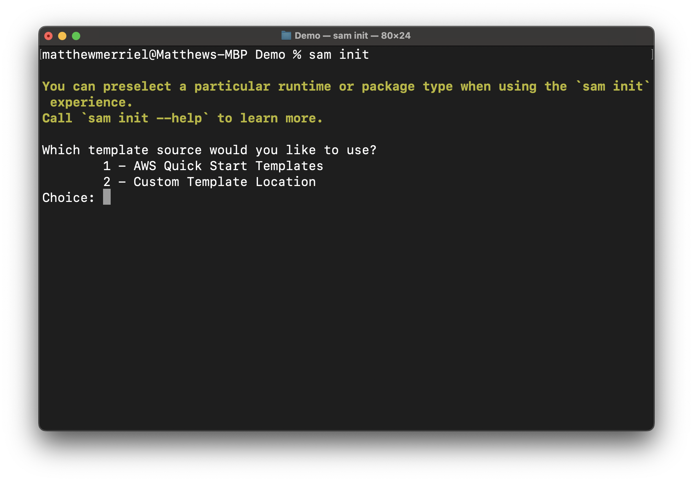
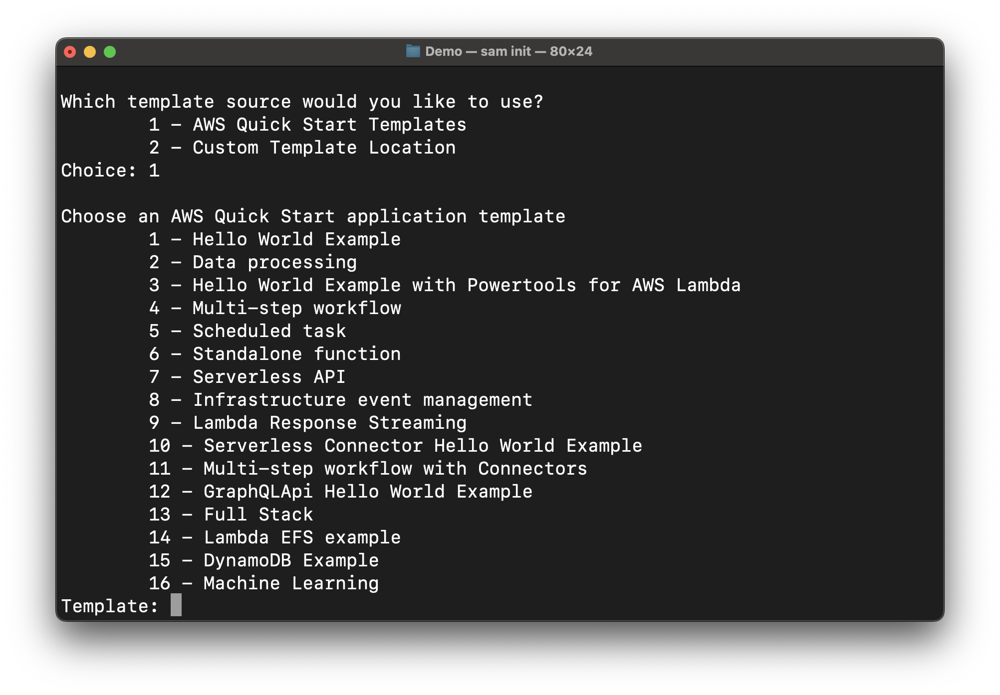
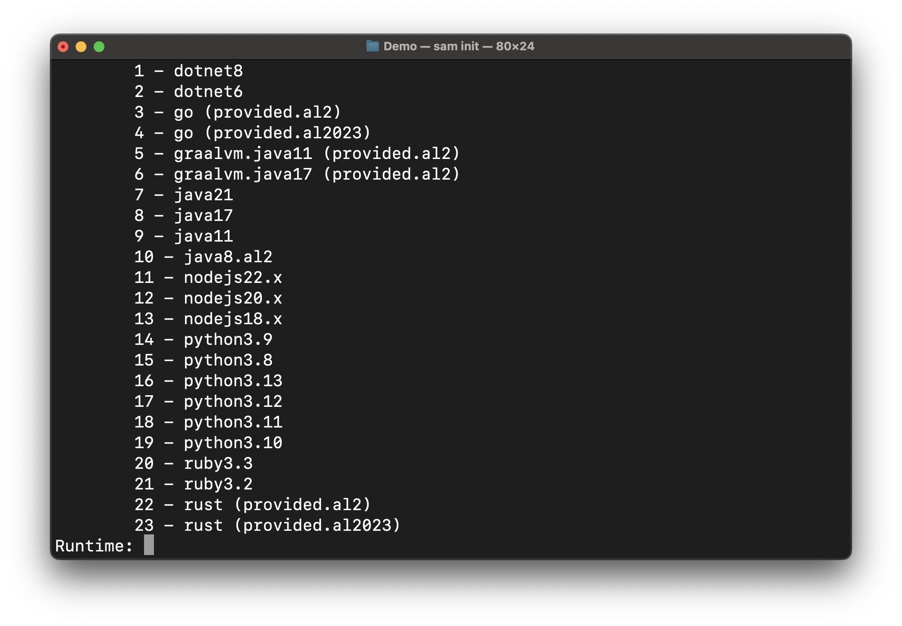
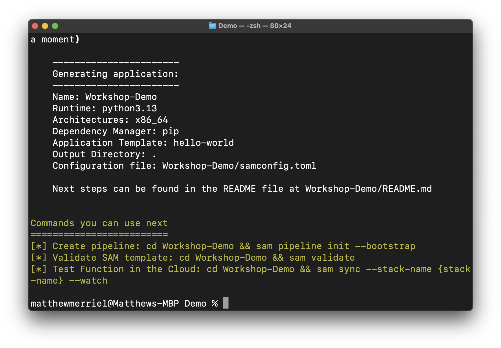
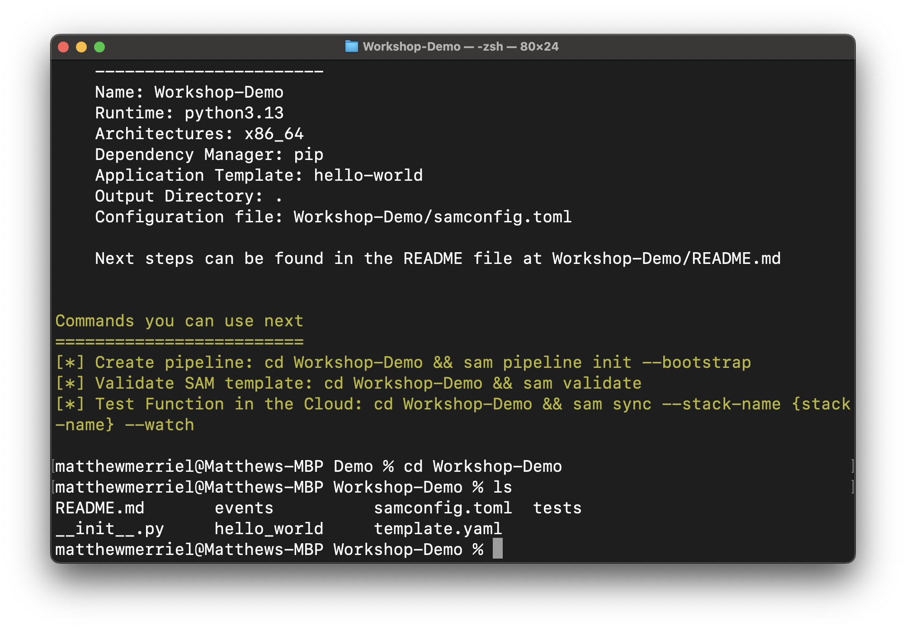

# Time to actually start developing something
OK, so let's start building something.

The goal of this section is to setup a new SAM application that we will use for the remainder of the workshop. We'll start be deploying a new "Hello World" application, before testing it's deployment into AWS. We'll then finish off the section by adding in a Step Function component which will be the State Machine that will control the application's executions.

1. Start by **browsing** into the new folder where you want your project to reside. This will be where a folder is created that will host the application
```
cd Demo
```

3. run **sam init** to kickstart the creation of a new project. After a moment you should be presented with something similar to the below



4. press option *1* to select *AWS Quick Start Templates* and press *enter*. From there you should be presented with another set of options.



5. Again, we will select option *1* from the list and press *enter*. While we could select one of the **Step Function** options... it will actually be easier if we start with the *hello world* option. 

6. Press *N* and *enter for 
```
"Use the most popular runtime and package type? (Python and zip) [y/N]:
```

7. Press *16* and *enter* to select **Python3.13**. 



> If you don't have **python3.13** as an option, your SAM install might be out of date and you should update it before continuing be revisiting the SAM install steps [here](../Prepare-Local-Development-Environment/Install-AWS-SAM.md).

8. Press *1* and *enter* for **Zip**.
```
What package type would you like to use?
	1 - Zip
	2 - Image
Package type: 
```
9. Press *N* and *enter* as we will not be using X-Ray in this project.
```
Would you like to enable X-Ray tracing on the function(s) in your application?  [y/N]: 
```

10. Press *N* and *enter* again, as we will also not be using **CloudWatch Application Insights** in this project.
```
Would you like to enable monitoring using CloudWatch Application Insights?
For more info, please view https://docs.aws.amazon.com/AmazonCloudWatch/latest/monitoring/cloudwatch-application-insights.html [y/N]: 
```

11. Once more, press *N* and *enter* as we will not need structured Logging either.
```
Would you like to set Structured Logging in JSON format on your Lambda functions?  [y/N]: 
```
12. Give the Project a name. In this example I'm going to call it "Workshop-Demo". Press *enter* to continue.
```
Project name [sam-app]: Workshop-Demo
```

At this point, SAM will clone out the template project and and setup a copy of it on your local machine. This should only take a minute and once complete you should be looking at a screen like the one shown below:



If you *cd* into the *Workshop-Demo* project, and do a *ls* (or *dir* if your on windows)... you should see a drictory structure similar to the below:



## Git
While not a part of the workshop, it is recommended that you leverage some form of source code versioning with your projects. to that end you should initialise a git instance in this folder so it can start tracking changes for you
```
git init
```

## We have the beginnings of a project
we now have a skeleton project setup on our local machine ready for us to work with. In the next section, we'll deploy our project to AWS to make sure everything is working, before we start adding functionality to our app. Click [here](Deploy-SAM-Application.md) to move to the deploy phase.